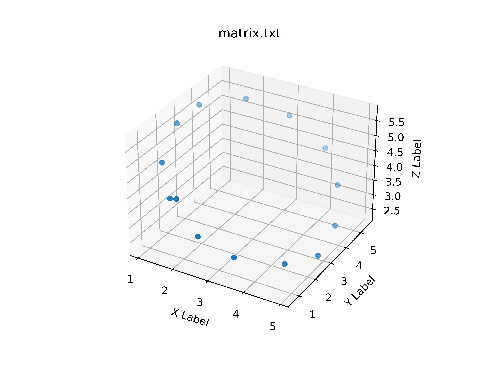
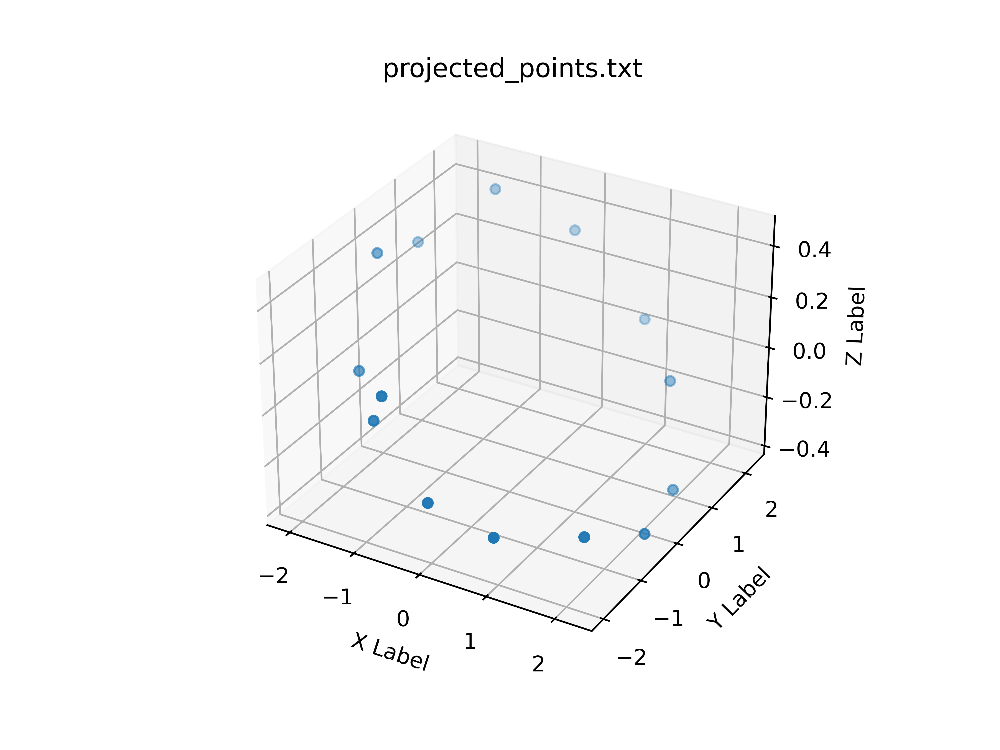
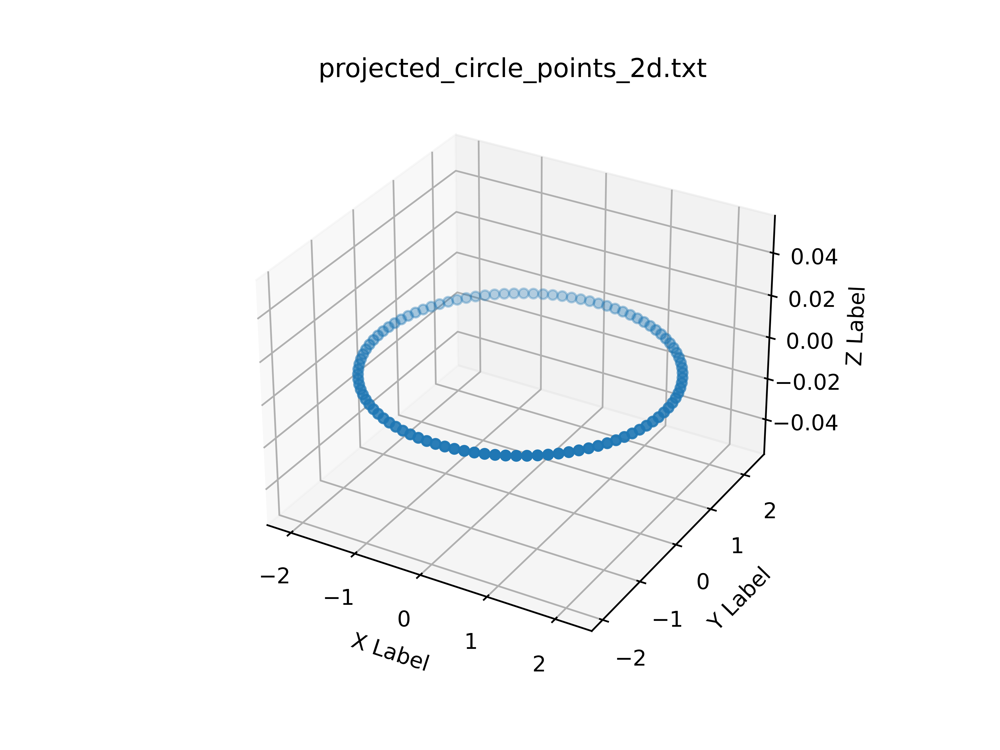
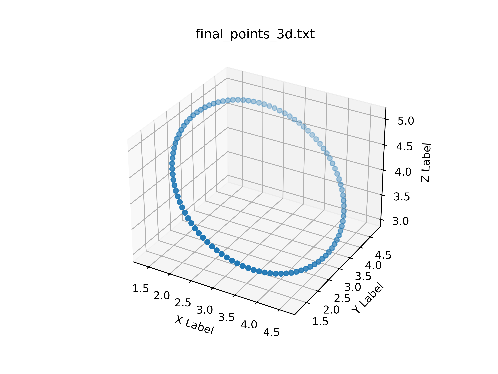

## Circle Fitting using C++


### Objective
I had come across an interesting problem of fitting 3D points to a circle, - note, ***to a circle, not a sphere in 3D space*** . On top of that using C++, only using `Eigen` library! I started looking other implementations. Couldn't find any! But I found a python implementation (referred in the Acknowledgement Section). So I getting the basics , and converting the code into C++. I enjoyed the full process. The achievements for me are following, 

- Familiarity with
- - C++ Eigen library
- - Singular Value Decomposition
- -  `Rodrigues' rotation formula` 
- Got huge confidence to work with C++ ! 

### The Points

I have hard-coded the points inside the code in lines `19-32`.

```
[[1.69394097, 0.89699047, 4.06276299],
[2.56823087, 0.69842007, 3.21497148],
[3.43271618, 0.98021214, 2.69155125],
[4.43213582, 1.85331114, 2.37948545],
[4.92328644, 2.82200303, 2.32861067],
[4.90166249, 3.95560872, 2.75117377],
[4.59295629, 4.80557214, 3.60124569],
[3.95215125, 5.45093418, 4.33841482],
[2.998557  , 5.257648  , 5.21266337],
[2.04399771, 4.61768856, 5.75436283],
[1.16719407, 3.63895906, 5.71525569],
[1.04464029, 2.60742983, 5.51914509],
[1.11656632, 1.59732638, 4.70627518],
[1.86951642, 0.90311449, 4.10275629]]
```


### Proposed Solution


I have followed this approach. (Line no of codes in the bracets)

- Getting the best fitting plane for the points using Singular Value Decomposition (36-45)
- Projecting the 3D points into the 2D plain (87-107)
- Fitting 2D circle on the plain (110-128)
- Generating the points of the circle according to the center and the radius of the circle (130-140)
- Project them back into the 3D axis (69-73)


#### Given Points


#### Fitting the best plain on the given 3D points

This is the hardest part. Here I had to use Singular Value Decomposition. The last column of the V matrix is the normal to the fitting plain. At first I got the center of the given points from the mean. Then I subtracted the center from the points to convert them into mean centered points.

#### Projection 

I used `Rodrigues' rotation formula` to project the 3D points into the plain. 

#### Fitting 2D Circle

I used method of least squares to get the best fitting circle. Given a set of 2D coordinates of a circle , I can refactor the equation of the circle into a set of linear system. [Reference](https://meshlogic.github.io/posts/jupyter/curve-fitting/fitting-a-circle-to-cluster-of-3d-points/)



#### Generating Points, and Reproject them back.
I Generated points according the equation of the circle



Then I reprojected them using same method of `Rodrigues' rotation formula` . 

### Final fit



## How to use

### Compile, and Run

```
 g++ curve_fitting.cpp -o curve_fit -std=c++11
 ./curve_fit
 ```

 ### Plotting the points

 For plotting I have wrote a python script 

 ```
 python plot_3d.py <input> --output <output_dir>
 ```

 - `input`: Input text file of the points
 - `--output`: Output directory to save the plots

 ## Scopes of Improvement

 - Unit tests
 - Containerazitaion
 - It looks weird, but I need to load the matrix from a text file instead of hard-coding it.


## Acknowledgement

I have took help from this link https://meshlogic.github.io/posts/jupyter/curve-fitting/fitting-a-circle-to-cluster-of-3d-points/ . They explained the theory behind the problem. I converted their approach into C++